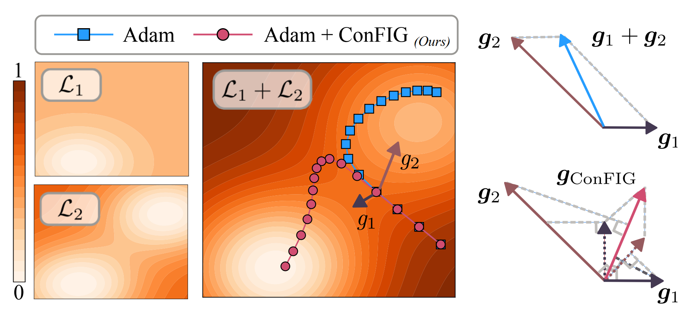

<h1 align="center">
  
</h1>

<h4 align="center">Official implementation of Conflict-Free Inverse Gradients Method</h4>
<h6 align="center">Towards Conflict-free Training for Everything and Everyone!</h6>

<p align="center">
  [<a href="https://arxiv.org/abs/2408.11104">📄 Research Paper</a>]•[<a href="https://tum-pbs.github.io/ConFIG/">📖 Documentation & Examples</a>]
</p>

## About

* **What is the ConFIG method?**

​	The conFIG method is a generic method for optimization problems involving **multiple loss terms** (e.g., Multi-task Learning, Continuous Learning, and Physics Informed Neural Networks). It prevents the optimization from getting stuck into a local minimum of a specific loss term due to the conflict between losses. On the contrary, it leads the optimization to the **shared minimum of all losses** by providing a **conflict-free update direction.**

<p align="center">

</p>

* **How does the ConFIG work?**

​	The ConFIG method obtains the conflict-free direction by calculating the inverse of the loss-specific gradients matrix:

```math
\boldsymbol{g}_{ConFIG}=\left(\sum_{i=1}^{m} \boldsymbol{g}_{i}^\top\boldsymbol{g}_{u}\right)\boldsymbol{g}_u,
```

```math
\boldsymbol{g}_u = \mathcal{U}\left[
[\mathcal{U}(\boldsymbol{g}_1),\mathcal{U}(\boldsymbol{g}_2),\cdots, \mathcal{U}(\boldsymbol{g}_m)]^{-\top} \mathbf{1}_m\right].
```

Then the dot product between $\boldsymbol{g}_{ConFIG}$ and each loss-specific gradient is always positive and equal, i.e., $`\boldsymbol{g}_{i}^{\top}\boldsymbol{g}_{ConFIG}=\boldsymbol{g}_{j}^{\top}\boldsymbol{g}_{ConFIG}> 0  \quad \forall i,j \in [1,m]`$​.

* **Is the ConFIG computationally expensive?**

​	Like many other gradient-based methods, ConFIG needs to calculate each loss's gradient in every optimization iteration, which could be computationally expensive when the number of losses increases. However, we also introduce a **momentum-based method** where we can reduce the computational cost **close to or even lower than a standard optimization procedure** with a slight degeneration in accuracy. This momentum-based method is also applicable to other gradient-based methods.

## Paper Info

<h4 align="center">ConFIG: Towards Conflict-free Training of Physics Informed Neural Networks</h4>
<h6 align="center"> <a href="https://qiauil.github.io/">Qiang Liu</a>,  <a href="https://rachelcmy.github.io/">Mengyu Chu</a>, and  <a href="https://ge.in.tum.de/about/n-thuerey/">Nils Thuerey</a></h6>

<h6 align="center">
     Technical University of Munich
     Peking University
</h6>

***Abstract:*** The loss functions of many learning problems contain multiple additive terms that can disagree and yield conflicting update directions. For Physics-Informed Neural Networks (PINNs), loss terms on initial/boundary conditions and physics equations are particularly interesting as they are well-established as highly difficult tasks. To improve learning the challenging multi-objective task posed by PINNs, we propose the ConFIG method, which provides conflict-free updates by ensuring a positive dot product between the final update and each loss-specific gradient. It also maintains consistent optimization rates for all loss terms and dynamically adjusts gradient magnitudes based on conflict levels. We additionally leverage momentum to accelerate optimizations by alternating the back-propagation of different loss terms. The proposed method is evaluated across a range of challenging PINN scenarios, consistently showing superior performance and runtime compared to baseline methods. We also test the proposed method in a classic multi-task benchmark, where the ConFIG method likewise exhibits a highly promising performance. 

***Read from:*** [[Arxiv](https://arxiv.org/abs/2408.11104)]

***Cite as:*** 

```latex
@article{Liu2024ConFIG,
author = {Qiang Liu and Mengyu Chu and Nils Thuerey},
title = {ConFIG: Towards Conflict-free Training of Physics Informed Neural Networks},
year={2024},
url={https://arxiv.org/abs/2408.11104},
}
```

## Installation

* Install through `pip`: `pip install conflictfree`
* Install from repository online: `pip install git+https://github.com/tum-pbs/ConFIG`
* Install from repository offline: Download the repository and run `pip install .` or `install.sh` in terminal.
* Install from released wheel: Download the wheel and run `pip install conflictfree-x.x.x-py3-none-any.whl` in terminal.

## Usage

For a muti-loss optimization, you can simply use ConFIG method as follows:

Without `ConFIG`:

```python
optimizer=torch.Adam(network.parameters(),lr=1e-3)
for input_i in dataset:
    losses=[]
    optimizer.zero_grad()
    for loss_fn in loss_fns:
        losses.append(loss_fn(network,input_i))
    torch.cat(losses).sum().backward()
    optimizer.step()
```

With `ConFIG`:

```python
from conflictfree.grad_operator import ConFIG_update
from conflictfree.utils import get_gradient_vector,apply_gradient_vector
optimizer=torch.Adam(network.parameters(),lr=1e-3)
for input_i in dataset:
    grads=[]
    for loss_fn in loss_fns:
    	optimizer.zero_grad()
    	loss_i=loss_fn(input_i)
        loss_i.backward()
        grads.append(get_gradient_vector(network)) #get loss-specfic gradient
    g_config=ConFIG_update(grads) # calculate the conflict-free direction
    apply_gradient_vector(network) # set the condlict-free direction to the network
    optimizer.step()
```

More details and examples can be found in our [doc page](https://tum-pbs.github.io/ConFIG/).

To reproduce the result in our paper, please check the [experiments](https://github.com/tum-pbs/ConFIG/tree/main/experiments) folder.

## Additional Info
This project is part of the physics-based deep learning topic in [**Physics-based Simulation group**](https://ge.in.tum.de/) at TUM.
