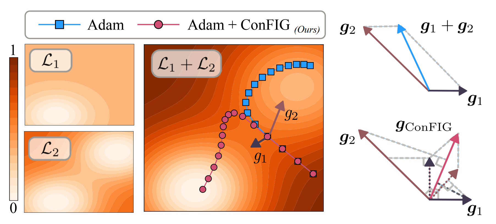

# ConFIG: Conflict-Free Inverse Gradients Method

<h1 align="center">
  
</h1>

<h4 align="center">Official implementation of Conflict-Free Inverse Gradients Method</h4>
<h6 align="center">Towards Conflict-free Training for everything!</h6>

<p align="center">
  [<a href="https://arxiv.org/abs/2312.05320">Arxiv</a>]•[<a href="https://tum-pbs.github.io/ConFIG/">📖 Documentation & Examples</a>]
</p>

## About

* **What is the ConFIG method?**

​	The conFIG method is a generic method for optimization problems involving **multiple loss terms** (e.g., Multi-task Learning, Continuous Learning, and Physics Informed Neural Networks). It prevents the optimization from getting stuck into a local minimum of a specific loss term due to the conflict between losses. On the contrary, it leads the optimization to the **shared minimal of all losses** by providing a **conflict-free update direction.**



* **How does the ConFIG work?**

​	The ConFIG method obtains the conflict-free direction by calculating the inverse of the loss-specific gradients matrix:

$$
\boldsymbol{g}_{ConFIG}=\left(\sum_{i=1}^{m} \boldsymbol{g}_{i}^\top\boldsymbol{g}_{u}\right)\boldsymbol{g}_u,
$$

$$
\boldsymbol{g}_u = \mathcal{U}\left[
[\mathcal{U}(\boldsymbol{g}_1),\mathcal{U}(\boldsymbol{g}_2),\cdots, \mathcal{U}(\boldsymbol{g}_m)]^{-\top} \mathbf{1}_m\right].
$$

Then the dot product between $\boldsymbol{g}_{ConFIG}$ and each loss-specific gradient is always positive and equal, i.e., $\boldsymbol{g}_{i}^{\top}\boldsymbol{g}_{ConFIG}=\boldsymbol{g}_{i}^{\top}\boldsymbol{g}_{ConFIG} \quad \forall i,j \in [1,m]$​.

* **Is the ConFIG Computationally expensive?**

​	Like many other gradient-based methods, ConFIG needs to calculate each loss's gradient in every optimization iteration, which could be computationally expensive when the number of losses increases. However, we also introduce a **momentum-based method** where we can reduce the computational cost **close to or even lower than a standard optimization procedure** with a slight degeneration in accuracy. This momentum-based method is also applied to another gradient-based method.

## Paper Info

<h4 align="center">ConFIG: Towards Conflict-free Training of Physics Informed Neural Networks</h4>
<h6 align="center"> <a href="https://tum-pbs.github.io/">Qiang Liu</a>,  <a href="https://rachelcmy.github.io/">Mengyu Chu</a>, and  <a href="https://ge.in.tum.de/about/n-thuerey/">Nils Thuerey</a></h6>

<h6 align="center">
     Technical University of Munich
     Peking University
</h6>

***Abstract:*** The loss functions of many learning problems contain multiple additive terms that can disagree and yield conflicting update directions. For Physics-Informed Neural Networks (PINNs), loss terms on initial/boundary conditions and physics equations are particularly interesting as they are well-established as highly difficult tasks. To improve learning the challenging multi-objective task posed by PINNs, we propose the ConFIG method, which provides conflict-free updates by ensuring a positive dot product between the final update and each loss-specific gradient. It also maintains consistent optimization rates for all loss terms and dynamically adjusts gradient magnitudes based on conflict levels. We additionally leverage momentum to accelerate optimizations by alternating the back-propagation of different loss terms. The proposed method is evaluated across a range of challenging PINN scenarios, consistently showing superior performance and runtime compared to baseline methods. We also test the proposed method in a classic multi-task benchmark, where the ConFIG method likewise exhibits a highly promising performance. 

***Read from:*** [[Arxiv](https://arxiv.org/abs/2312.05320)]

***Cite as:*** 

```latex
@article{Liu2024ConFIG,
author = {Liu, Qiang and Chu, Mengyu and Thuerey, Nils},
title = {Uncertainty-Aware Surrogate Models for Airfoil Flow Simulations with Denoising Diffusion Probabilistic Models},
year={2024},
url={arXiv XXXX},
}
```

## Aditional Info
This project is part of the physics-based deep learning topic in **Physics-based Simulation group** at TUM. Please visit our [homepage](https://ge.in.tum.de/) to see more related publications.