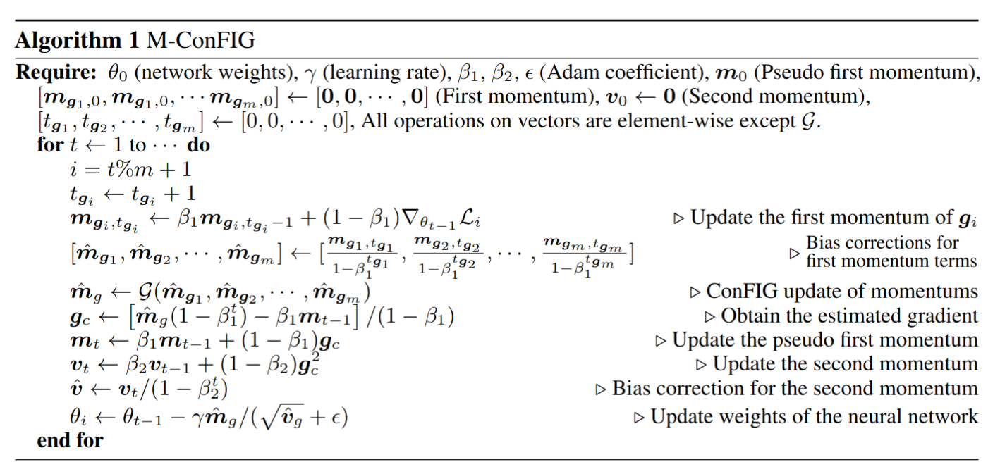

# Theory Introduction

Our ConFIG method aims to eliminate conflicts among multiple loss terms in gradient descent optimizations.

## ConFIG

Generically, we consider an optimization procedure with a set of $m$ individual loss functions, i.e., $\{\mathcal{L}_1,\mathcal{L}_2,\cdots,\mathcal{L}_m\}$. Let $\{\mathbf{g}_1,\mathbf{g}_2, \cdots, \mathbf{g}_m\}$ denote the individual gradients corresponding to each of the loss functions. A gradient-descent step with gradient $\mathbf{g}_c$ will conflict with the decrease of $\mathcal{L}_i$ if $\mathbf{g}_i^\top \mathbf{g}_c$ is **negative**. Thus, to ensure that all losses are decreasing simultaneously along $\mathbf{g}_c$, all $m$ components of  $[\mathbf{g}_1,\mathbf{g}_2,\cdots, \mathbf{g}_m]^\top\mathbf{g}_c$ should be positive. This condition is fulfilled by setting $\mathbf{g}_c = [\mathbf{g}_1,\mathbf{g}_2,\cdots, \mathbf{g}_m]^{-\top} \mathbf{w}$,  where $\mathbf{w}=[w_1,w_2,\cdots,w_m]$ is a vector with $m$ positive components and $M^{-\top}$ is the pseudoinverse of the transposed matrix $M^{\top}$​. 

Although a positive $\mathbf{w}$ vector guarantees a conflict-free update direction for all losses, the specific value of $w_i$ further influences the exact direction of $\mathbf{g}_c$. To facilitate determining $\mathbf{w}$, we reformulate $\mathbf{g}_c$ as $\mathbf{g}_c=k[\mathcal{U}(\mathbf{g}_1),\mathcal{U}(\mathbf{g}_2),\cdots, \mathcal{U}(\mathbf{g}_m)]^{-\top} \mathbf{\hat{w}}$, where $\mathcal{U}(\mathbf{g}_i)=\mathbf{g}_i/(|\mathbf{g}_i|+\varepsilon)$ is a normalization operator and $k>0$. Now, $k$ controls the length of $\mathbf{g}_c$ and the ratio of $\mathbf{\hat{w}}$'s components corresponds to the ratio of $\mathbf{g}_c$'s projections onto each loss-specific $\mathbf{g}_i$, i.e., $|\mathbf{g}_c|\mathcal{S}_c(\mathbf{g},\mathbf{g}_i)$, where $\mathcal{S}_c(\mathbf{g}_i,\mathbf{g}_j)=\mathbf{g}_i^\top\mathbf{g}_j/(|\mathbf{g}_i||\mathbf{g}_j|+\varepsilon)$ is the operator for cosine similarity:

$$
\frac{
|\mathbf{g}_c|\mathcal{S}_c(\mathbf{g}_c,\mathbf{g}_i)
}{
|\mathbf{g}_c|\mathcal{S}_c(\mathbf{g}_c,\mathbf{g}_j)
}
=
\frac{
\mathcal{S}_c(\mathbf{g}_c,\mathbf{g}_i)
}{
\mathcal{S}_c(\mathbf{g}_c,\mathbf{g}_j)
}
=
\frac{
\mathcal{S}_c(\mathbf{g}_c,k\mathcal{U}(\mathbf{g}_i))
}{
\mathcal{S}_c(\mathbf{g}_c,k\mathcal{U}(\mathbf{g}_j))
}
=
\frac{
[k\mathcal{U}(\mathbf{g}_i)]^\top \mathbf{g}_c
}{
[k\mathcal{U}(\mathbf{g}_j)]^\top \mathbf{g}_c
}
=
\frac{\hat{w}_i
}{
\hat{w}_j
}
\quad
\forall i,j \in [1,m].
$$

We call $\mathbf{\hat{w}}$ the **direction weight**. The projection length of $\mathbf{g}_c$ on each loss-specific gradient serves as an effective “learning rate'' for each loss. Here, we choose $\hat{w}_i=\hat{w}_j \ \forall i,j \in [1,m]$ to ensure a uniform decrease rate of all losses, as it was shown to yield a weak form of Pareto optimality for multi-task learning. 

Meanwhile, we introduce an adaptive strategy for the length of $\mathbf{g}_c$ rather than directly setting a fixed value of $k$. We notice that the length of $\mathbf{g}_c$ should increase when all loss-specific gradients point nearly in the same direction since it indicates a favorable direction for optimization. Conversely, when loss-specific gradients are close to opposing each other, the magnitude of $\mathbf{g}_c$ should decrease. We realize this by rescaling the length of $\mathbf{g}_c$ to the sum of the projection lengths of each loss-specific gradient on it, i.e., $|\mathbf{g}_c|=\sum_{i=1}^m|\mathbf{g}_i|\mathcal{S}_c(\mathbf{g}_i,\mathbf{g}_c)$. 

The procedures above are summarized in the **Con**flict-**F**ree **I**nverse **G**radients (ConFIG) operator $G$ and we correspondingly denote the final update gradient $\mathbf{g}_c$ with $\mathbf{g}_{\text{ConFIG}}$:

$$
\mathbf{g}_{\text{ConFIG}}=\mathcal{G}(\mathbf{g}_1,\mathbf{g}_1,\cdots,\mathbf{g}_m):=\left(\sum_{i=1}^m \mathbf{g}_i^\top\mathbf{g}_u\right)\mathbf{g}_u,
$$

$$
\mathbf{g}_u = \mathcal{U}\left[
[\mathcal{U}(\mathbf{g}_1),\mathcal{U}(\mathbf{g}_2),\cdots, \mathcal{U}(\mathbf{g}_m)]^{-\top} \mathbf{1}_m\right].
$$

Here, $\mathbf{1}_m$ is a unit vector with $m$ components. These two equations are implemented as [conflictfree.grad_operator.ConFIG_update()](../../api/grad_operator/#conflictfree.grad_operator.ConFIG_update) and [conflictfree.grad_operator.ConFIGOperator.calculate_gradient()](../../api/grad_operator/#conflictfree.grad_operator.ConFIGOperator.calculate_gradient). Meanwhile, we also provide [weight_model](../../api/weight_model/) to allow you implement different direction weights ($\hat{\mathbf{w}}=\mathbf{1}_m$ as default) and [length_model](../../api/length_model/) to allow you design different length projection (the above adaptive strategy as default). We encourage you to design and try different weight/length models and compare the result with default configurations.

## ConFIG in two-loss scenario
For the special case of only two loss terms, there is an equivalent form of ConFIG that does not require a pseudoinverse:

$$
\begin{align}
\mathcal{G}(\mathbf{g}_1,\mathbf{g}_2)=(\mathbf{g}_1^\top\mathbf{g}_{v}+\mathbf{g}_2^\top\mathbf{g}_{v}) \mathbf{g}_{v} 
\\
\mathbf{g}_{v}=\mathcal{U}\left[\mathcal{U}(\mathcal{O}(\mathbf{g}_1,\mathbf{g}_2))+\mathcal{U}(\mathcal{O}(\mathbf{g}_2,\mathbf{g}_1))\right]
\end{align}
$$

where $\mathcal{O}(\mathbf{g}_1,\mathbf{g}_2)=\mathbf{g}_2-\frac{\mathbf{g}_1^\top\mathbf{g}_2}{|\mathbf{g}1|^2}\mathbf{g}_1$ is the orthogonality operator. It returns a vector orthogonal to $\mathbf{g}_1$ from the plane spanned by $\mathbf{g}_{1}$ and $\mathbf{g}_{2}$. 

This equivlance is implemented as [conflictfree.grad_operator.ConFIG_update_double()](../../api/grad_operator/#conflictfree.grad_operator.ConFIG_update_double). You can also set `allow_simplified_model` to true in [conflictfree.grad_operator.ConFIGOperator](../../api/grad_operator/#conflictfree.grad_operator.ConFIGOperator) to enable using this form in two-loss scenario.

## M-ConFIG

Gradient-based methods like the proposed ConFIG method require separate backpropagation steps to compute the gradient for each loss term, which could be computationally expensive.  To address this issue, we introduce an accelerated momentum-based variant of ConFIG: **M-ConFIG**. Our core idea is to leverage the momentum of the gradient for the ConFIG operation and update momentum variables in an alternating fashion to avoid backpropagating all losses in a single step. In each iteration, only a single momentum is updated with its corresponding gradient, while the others are carried over from previous steps.  Algorithm 1 details the entire procedure of M-ConFIG.

The M-ConFIG method is implemented as [conflictfree.momentum_operator.PseudoMomentumOperator](../../api/momentum_operator/#conflictfree.momentum_operator.PseudoMomentumOperator). This momentum method can also be used for other gradient-based methods. In [conflictfree.momentum_operator.PseudoMomentumOperator](../../api/momentum_operator/#conflictfree.momentum_operator.PseudoMomentumOperator), you can modify the `gradient_operator` parameter to enable momentum acceleration for other methods.

---

For detailed discussion of the background theory, please check our [research paper](https://arxiv.org/abs/2408.11104).